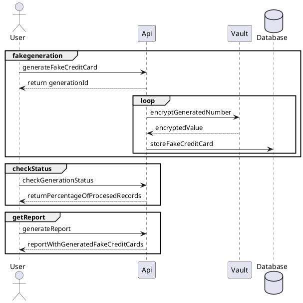

REQUIREMENTS
1. Installed `docker`
2. Installed `docker-compose`

DOCUMENTATION
1. How does it work

2. Api documentation
a) generate by yourself
```
$ cd ./documentation
$ npx redoc-cli bundle api.yml
```
redoc-static.html should be placed in ./documentation/redoc-static.html
b) or open currently generated recoc-static.html in your webbrowser

USER GUIDE
1. Run  dependant services (vault, rabbit, database)
```
docker-compose up -d
```
2. Initialize vault
```
docker exec -it vault /bin/sh
/vault/data/vault-init.sh
```
3. Create token for application approle
```
vault write auth/approle/login \
    role_id=8b6b72c7-2ab8-a8ed-e329-4528a34bc3c7 \
    secret_id=16887948-e8f5-5905-b208-3e727354454c

Key                Value
---                -----
token              65b74ffd-842c-fd43-1386-f7d7006e520a
token_accessor     3c29bc22-5c72-11a6-f778-2bc8f48cea0e
token_duration     20m0s
token_renewable    true
token_policies     [default]

```
4. Copy token and set it in application.yml
```
spring:
  cloud:
    vault:
      token: yourtokenhere
```
5. Run financeapp
```

```
7. Start generation
```
curl --request POST \
    --header "Content-Type: application/json" \
    --data '{"numberOfCreditCardsToGenerate":10, "emailAddress":"radikowalczyk@gmail.com"}' \
    http://localhost:8080/finance/creditcard/fakegenaration
```
Spring batch job is running. Store returned uuid which is your generation identificator.

There are alternatives to increase performance with spring batch:
   Multithreading - easiest way (via TaskExecutor), but only when we don't need restart or we need restart but also can store state of processed item. If we need restarts and can't store the state (eq. when we process file) - this approach can't be used. 
    runs reader, processor and writers in same thread. Remember to write each of them as 'thread safe' (eq. JdbcPagingItemReader rather than JdbcCursorItemReader)
   Remote chunking - when item processing takes much time (not read/write action)
   Remote partitioning - when read/write operation is a bootleneck
   Parallel Steps - Using Spring Batch's split functionality you can execute multiple steps in parallel.

We decided to use multithreaded and parallel steps to improve performance.
It is the easiest way and we don't have to care about the major limitation because we can store state (eq. - is_processed flag ) and in fact we don't need to restart process

8. Check the current state of processing
```
curl --request POST \
--header "Content-Type: application/json" \
--data '{"generationId": "5c41aa14-bbfe-4b3e-9b13-56b3fd9b6fba"}' \
http://localhost:8080/finance/creditcard/fakegeneration/status
```
9. Generate and download the report
```
curl --request POST \
--header "Content-Type: application/json" \
--data '{"generationId": "5c41aa14-bbfe-4b3e-9b13-56b3fd9b6fba", "decrypted": "false"}' \
http://localhost:8080/finance/creditcard/fakegeneration/report
```

