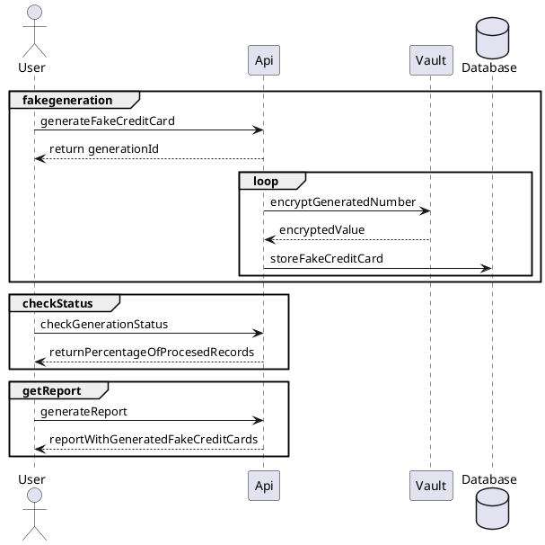

REQUIREMENTS
1. Installed `docker`
2. Installed `docker-compose`

DOCUMENTATION
1. How does it work?

Open below in: http://www.plantuml.com/plantuml/uml/

2. Api documentation
a) generate by yourself
```
$ cd ./documentation
$ npx redoc-cli bundle api.yml
```
redoc-static.html should be placed in ./documentation/redoc-static.html

b) or open currently generated recoc-static.html in your webbrowser

USER GUIDE
1. Start vault
```
docker-compose up -d vault
```

2. Create token for application approle
```
docker exec -it vault /bin/sh

vault write auth/approle/login \
    role_id=52bde1e0-2a2f-7fe4-1ff9-a04b5ce89516 \
    secret_id=2cd46a08-dfd4-dd6b-9c0c-4c100f4e1c52

Key                Value
---                -----
token              65b74ffd-842c-fd43-1386-f7d7006e520a
token_accessor     3c29bc22-5c72-11a6-f778-2bc8f48cea0e
token_duration     20m0s
token_renewable    true
token_policies     [default]

```
3. Copy token and set it in application
Change docker-compose.yml:
``` 
services:
  fake_cc_app:
    environment:
      - "spring.cloud.vault.token=yourtokenhere"
```

6. Run all other services 
```
docker-compose up -d
```
7. Start generation
```
curl --request POST \
    --header "Content-Type: application/json" \
    --data '{"numberOfCreditCardsToGenerate":100000 }' \
    http://localhost:8080/finance/creditcard/fakegeneration
```
Spring batch job is running. Store returned uuid which is your generation identificator.

8. Check the current state of processing
```
curl --request POST \
--header "Content-Type: application/json" \
--data '{"generationId": "fba637bc-6e43-4c00-83a3-a157f2dbc4d2"}' \
http://localhost:8080/finance/creditcard/fakegeneration/status
```
9. Generate and download the report
```
curl 'http://localhost:8080/finance/creditcard/fakegeneration/report?generationId=fba637bc-6e43-4c00-83a3-a157f2dbc4d2&decrypted=false' -H 'Accept: text/html,application/xhtml+xml,application/xml;q=0.9,image/avif,image/webp,*/*;q=0.8' -o report.html

```

DEVELOPER GUIDE
1. Building docker image of app

a) Go to directory where Dockerfile is located and invoke:
``` 
docker image build -t fakecreditcard:latest .
```
b) push an image to repo
```
docker login --username=<user username> --password=<user password>
docker tag aedc0c1c67ae rdkk/coderdkk:fakecreditcard
docker push rdkk/coderdkk:fakecreditcard
```
